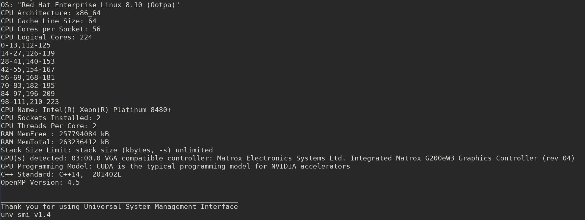

# unv-smi (Universal System Management Interface)
A simplified mechanism for instantaneously identifying your GPU & other system specs on any computer running any OS.   

**Requirements:** C++ compiler that supports at least C++14.

# Description 
When programming it's often useful to know the compute resources that are availabe to you ahead of time. 
This program reports crucial details of both the hardware, the software, the general architecture, and most
importantly, the GPU(s), through executing a simple, single source, c++ program. 

# Why is this useful? 
It's difficult to find information about your GPU if your GPU was not manufactured by nvidia. 
unv-smi was created as an alternative to [nvidia-smi](https://developer.nvidia.com/nvidia-system-management-interface) 
for revealing GPU information on systems that do not have Nvidia GPUs, and do not that do not have such a mechanism (though unv-smi works for NVIDIA GPUs too)   

# What if I don't have a GPU
See [example output](https://github.com/tommygorham/unv-smi/blob/main/README.md#example-output) below for all of the
info unv-smi reports. 
Since its inception, unv-smi has evolved into much more than a GPU resource identifier, and it has been
cited in [a PhD Dissertation at the University of Tennessee at Chattanooga](https://scholar.utc.edu/theses/788/)   

Universal System Management Interface was designed to work across a wide range of diversified machines, including complex computer cluster architectures with many cores, down to single-socket laptops with integrated graphics cards.  

Essentially any system with a modern C++ compiler will work. Some that have been tested are GCC, Clang++, Intel, MSVC, and AppleClang compilers on Apple Silicon Macs. 

# Build

```
mkdir build
cd build 
cmake .. 
make 
``` 
# Run 

```
./unv-smi
```

# Example Output 
### Linux unv-smi v1.4 


### Windows unv-smi v1.3


### Apple unv-smi v1.3


## Linux unv-smi v1.2
/redhatenterprise.png)

## More information 

Additional details can be found in the [Wiki](https://github.com/tommygorham/unv-smi/wiki).
