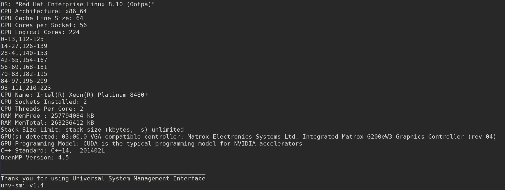

# unv-smi (Universal System Management Interface)
When programming, it's often useful to know the compute resources that are availabe to you beforehand. When profiling, it's often necessaary to report system specs. 
This program facilitates these tasks on any machine, any architecture, any GPU(s). 

**Compatibility:** Heterogeneous HPC clusters or standalone PCs running Linux, Windows, or MacOS.   
**Requirements:** C++ compiler that supports at least C++14.

Cited in [a PhD Dissertation at the University of Tennessee at Chattanooga](https://scholar.utc.edu/theses/788/). 

## Contribute 
If you are looking for an easy project to contibute to, submit a pull request with your output
in [example-output folder](https://github.com/tommygorham/unv-smi/tree/main/example-output) 

## Build

```
mkdir bld && cd bld 
cmake .. 
make 
``` 
## Run 

```
./unv-smi
```

## Output

https://github.com/user-attachments/assets/c3adec7c-d3db-4c49-8d1b-398e944a2e62

### Linux Cluster 


### Windows PC


[Additional details here](https://github.com/tommygorham/unv-smi/wiki).
