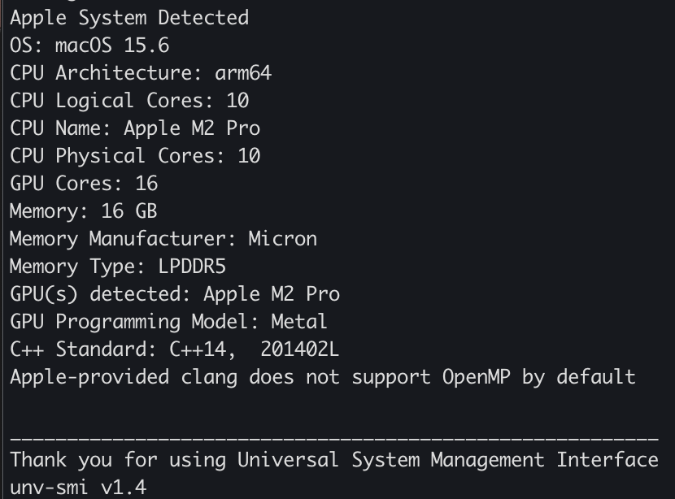

# unv-smi (Universal System Management Interface)
CLI tool to reveal some basic specs on any machine, any architecture, with any GPU(s). Created out of curiosity and the innate, vast difference in commands across operating systems that i grew tired of having to constantly remember. 

**Compatibility:** Heterogeneous HPC clusters or standalone PCs running Linux, Windows, or MacOS.   
**Requirements:** C++ compiler that supports at least C++14.


A friend of mine used this tool to help document results across different systems in his [PhD Dissertation at the University of Tennessee at Chattanooga](https://scholar.utc.edu/theses/788/). 

## Build
```
mkdir bld && cd bld 
cmake .. 
make 
``` 
## Run 
```
./unv-smi
```

### Linux


### MacOS 
 

### Windows 


[Additional examples](example-output)

[Additional details](https://github.com/tommygorham/unv-smi/wiki)
