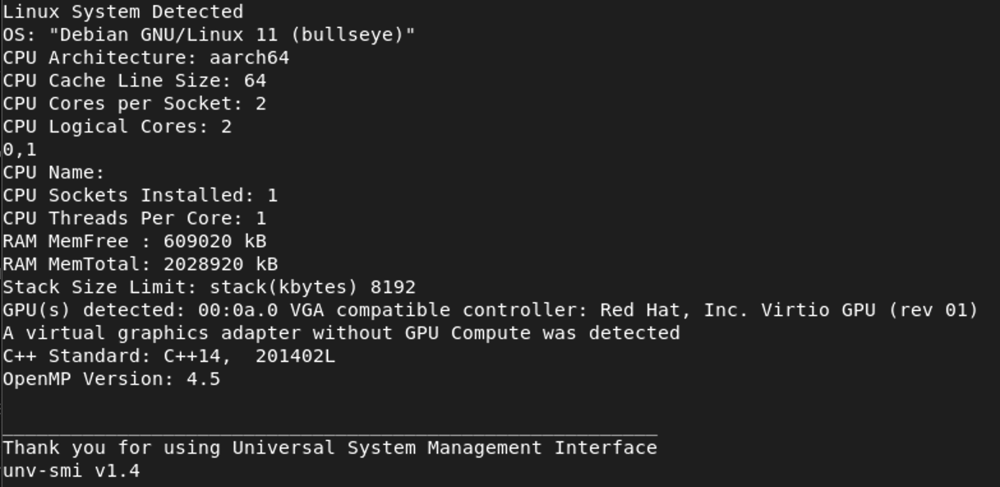

# unv-smi (Universal System Management Interface)
A simplified mechanism for instantaneously identifying your GPU + other system specs on any computer running any OS.   

Requirements: C++ compiler that supports at least C++14.

# Description 
When programming it's often useful to know the compute resources that are availabe to you ahead of time. 

This program aims to report crucial details of both the hardware, the software, the general architecture, and most
importantly, the GPU through executing a simple, single source, c++ program. 

# Why is this useful? 
This program was created as an alternative to [nvidia-smi](https://developer.nvidia.com/nvidia-system-management-interface) 
because I couldn't find an equivalent command on an AMD machine. 

Since its inception, unv-smi has evolved into much more than a GPU resource identifier, such that v1.3 was 
cited in a PhD Dissertation at the University of Tennessee at Chattanooga regarding it's usefulness. 

This is a programmer's tool, so all you will ever need is a C++ compiler, no NVIDIA Graphics card is necessary to identify your GPU(s). 

Universal System Management Interface was designed to work across a wide range of diversified machines, including complex computer cluster architectures with many cores, down to single-socket laptops with integrated graphics cards.  

Works with GCC, Clang++, MSVC, and AppleClang compilers and Apple Silicon Macs. 

# Build

```
mkdir build
cd build 
cmake .. 
make 
``` 
# Run 

```
./unv-smi
```

# Example Output 
### Parallels Desktop Linux VM on Mac


### Windows PC (MSVC 19) unvsmi-version-1.3


### Mac mini (AppleClang 14) unv-smi-version-1.3


### WSL2 (Clang 12) unv-smi-version-1.3


### Linux Cluster Example (Intel Xeon)unv-smi-version-1.2
/CentOS.png)

## Linux Cluster Example (IBM Power9) unvsmi-version-1.2
/redhatenterprise.png)

## More information 

Further details regarding what type of information is returned can be found in the [Wiki](https://github.com/tommygorham/unv-smi/wiki).
